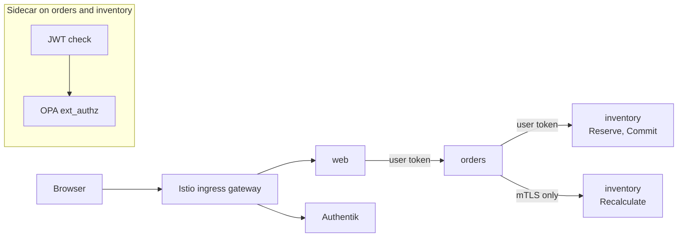
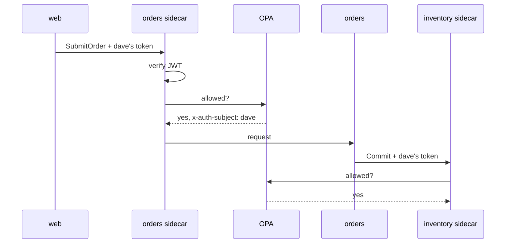

# Keep auth out of your services

Sample code for the article (link TBD).

`orders` and `inventory` (Go) and `web` (Python) contain no auth code.
Istio validates tokens, OPA decides, Authentik issues tokens.



## Run

Needs Docker, kind ≥ 0.33, kubectl, Helm, [Task](https://taskfile.dev).

```sh
task up      # cluster, Istio, Authentik, services (~5 min)
task test    # Rego unit tests + e2e in the mesh
task down
```

- App: http://web.localtest.me
- Authentik: http://auth.localtest.me (admin: `akadmin`)

Password for every user, including `akadmin`: **`demo-password`**

| User  | Group         | Scopes           | Can |
|-------|---------------|------------------|-----|
| alice | MyServiceRole | ReadOnly         | view |
| bob   | MyServiceRole | ReadWrite        | view, create |
| dave  | MyServiceRole | ReadOnly, Submit | view, submit |
| carol | none          | all three        | cannot log in |

Try it: log in as bob, create an order, submit it (403). Log in as dave in a
private window, submit the same order (200).

## Rules

`policies/data.json`, enforced by OPA:

| RPC | Needs |
|-----|-------|
| GetOrder, GetStock | group + ReadOnly or ReadWrite |
| CreateOrder, Reserve | group + ReadWrite |
| SubmitOrder, Commit | group + Submit |
| Recalculate | caller `spiffe://cluster.local/ns/demo/sa/orders` |



Authorization runs before service logic: bob submitting a missing order
gets 403, dave gets 404.

Services log the verified caller (`by`, `subject`) from the `X-Auth-Subject`
header OPA sets; they never decide on it.

## Caveats

- Separation of duties on the same order is out of scope (needs the order's
  creator, which only `orders` knows).
- HTTP only, demo secrets in `deploy/idp/`, in-memory state.
